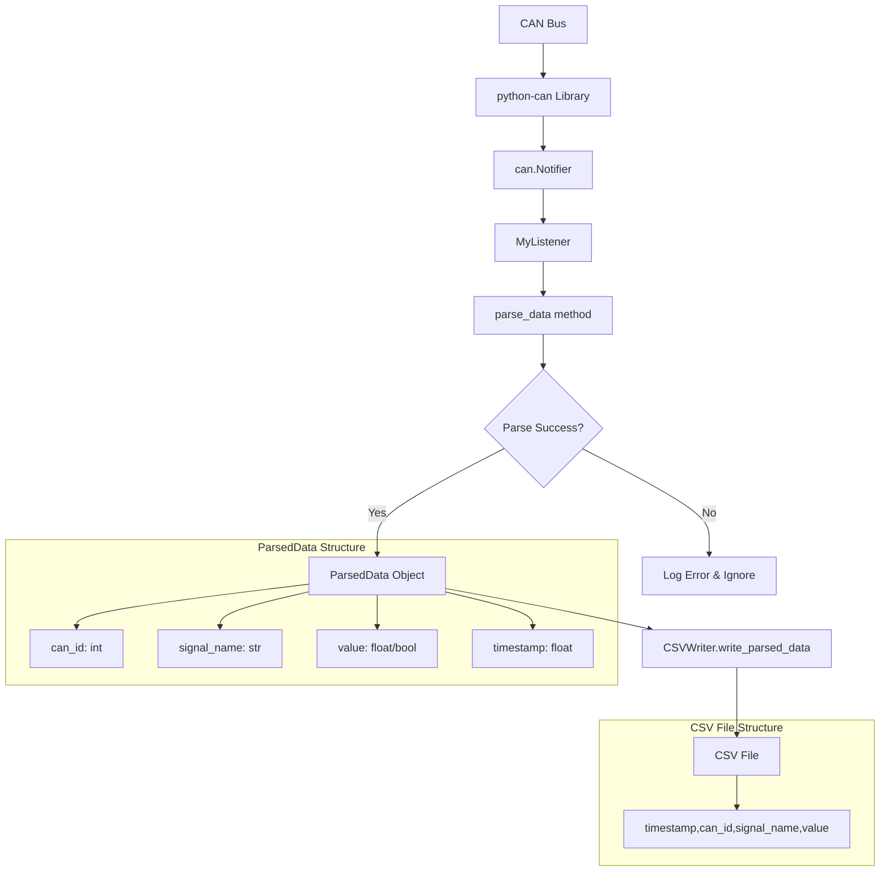

# CAN Data CSV Writer

This document explains the CSV writer functionality for logging CAN bus data to CSV files.

## Overview

The CSV writer module (`can_utils/csv_writer.py`) provides functionality to log parsed CAN bus data to CSV files in real-time. It works with the existing CAN message parsing system to convert raw CAN frames into human-readable data.

## Data Flow



## Usage Options

### Option 1: Standalone CAN to CSV

Create a script that uses only the CSV writer without the WebSocket API:

```python
#!/usr/bin/env python3
import can
import os
from can_utils.read_can_messages import MyListener
from can_utils.csv_writer import CSVWriter

# Initialize CSV writer
csv_file_path = os.path.join(os.path.dirname(__file__), "can_data.csv")
csv_writer = CSVWriter(csv_file_path)

# Create a custom listener that writes to CSV
class CSVListener(MyListener):
    def __init__(self, csv_writer):
        self.csv_writer = csv_writer

    def on_message_received(self, message):
        # Parse the message using the parent class method
        message_data = {
            "id": message.arbitration_id,
            "data": message.data,
            "timestamp": message.timestamp,
        }

        # Parse the message
        parsed = self.parse_data(message_data)
        if parsed:
            # Write to CSV
            self.csv_writer.write_parsed_data(
                can_id=parsed.can_id,
                signal_name=parsed.signal_name,
                value=parsed.value,
                timestamp=parsed.timestamp
            )

# Setup CAN bus
bus = can.interface.Bus(channel="can0", bustype="socketcan")

# Create and start the listener
csv_listener = CSVListener(csv_writer)
notifier = can.Notifier(bus, [csv_listener])

try:
    print("Listening for CAN messages and writing to CSV...")
    print(f"CSV file: {csv_file_path}")
    # Run indefinitely
    while True:
        import time
        time.sleep(1)
except KeyboardInterrupt:
    print("Stopping...")
    csv_writer.close()
    notifier.stop()
    bus.shutdown()
```

### Option 2: Use Existing API

The existing API already includes CSV functionality:

```bash
cd can-snooper/api
python3 main.py
```

This will:

1. Start a WebSocket server on port 8765
2. Listen for CAN messages
3. Parse them using the signal definitions
4. Write parsed data to `can-snooper/can_data.csv`
5. Also broadcast to WebSocket clients (if any)

## CSV File Format

The CSV file contains the following columns:

- `timestamp`: Unix timestamp of the CAN message
- `can_id`: CAN message identifier (decimal)
- `signal_name`: Human-readable signal name from the configuration
- `value`: Parsed value (float or boolean)

Example CSV content:

```
timestamp,can_id,signal_name,value
1234567890.123,256,Speed,42.5
1234567890.456,512,Brake,True
1234567890.789,768,Temperature,98.6
```

## Key Components

### CSVWriter Class

The `CSVWriter` class handles all file operations:

- Creates directories as needed
- Writes headers only for new files
- Appends to existing files without duplicating headers
- Provides immediate data flushing for real-time logging
- Includes proper resource cleanup

### ParsedData Structure

Each parsed CAN signal creates a `ParsedData` object with:

- `can_id`: Integer CAN identifier
- `signal_name`: String signal name from configuration
- `value`: Float or boolean value
- `timestamp`: Float Unix timestamp

### Signal Definitions

Signal parsing is configured via `sc1-data-format/format.json`:

```json
{
  "Speed": [4, "float", "mph", 0, 200, "Powertrain", 0x100],
  "Brake": [1, "boolean", "", false, true, "Safety", 0x200]
}
```

Each signal definition includes:

- Number of bytes
- Data type (float/boolean)
- Units
- Min/max values
- Subsystem
- CAN ID

## Running the System

1. Ensure CAN interface is configured:

   ```bash
   sudo ip link set can0 up type can bitrate 500000
   ```

2. Run either the standalone script or the API

3. Data will be collected to the CSV file in real-time

4. Stop with Ctrl+C (properly closes resources)

## Testing

The module includes comprehensive tests in `test_csv_writer.py`:

- Basic CSV writer functionality
- ParsedData object handling
- Append functionality
- Integration testing

Run tests with:

```bash
cd can-snooper
python3 test_csv_writer.py
```

## Data Analysis

The resulting CSV file can be analyzed with:

- Microsoft Excel
- Python pandas
- R
- Any data analysis tool that supports CSV format

Example Python analysis:

```python
import pandas as pd

# Load CSV data
df = pd.read_csv('can_data.csv')

# Convert timestamp to readable format
df['datetime'] = pd.to_datetime(df['timestamp'], unit='s')

# Analyze specific signals
speed_data = df[df['signal_name'] == 'Speed']
print(f"Average speed: {speed_data['value'].mean()}")
```
